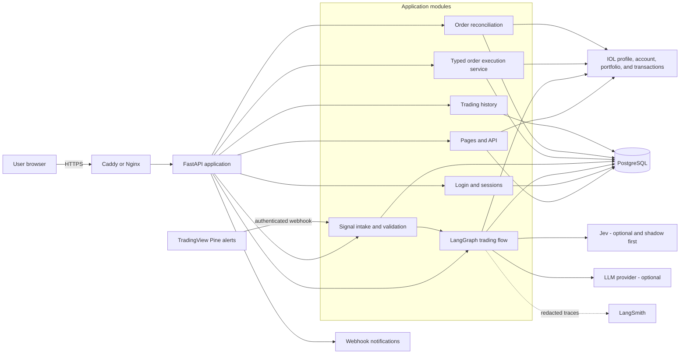
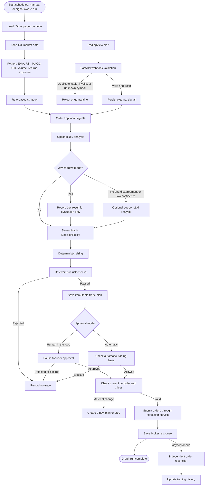
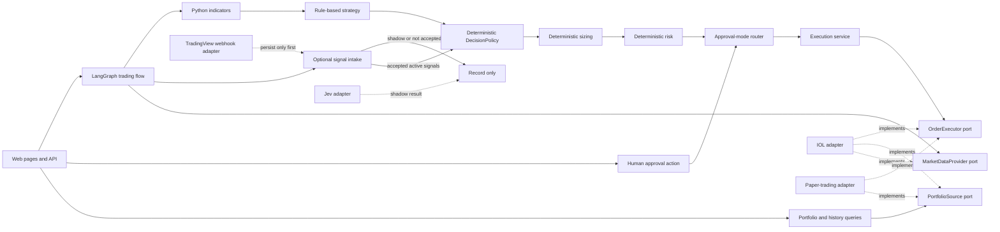
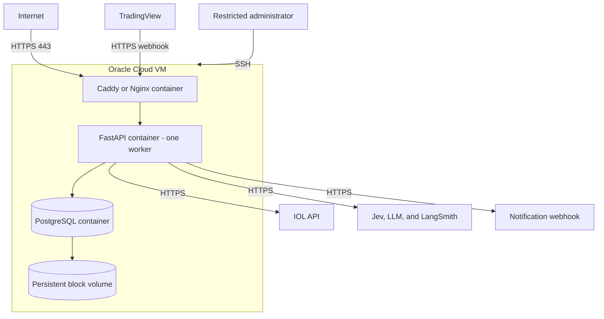

# ia-trading-broker

An automatic trading application for InvertirOnline (IOL), built with LangGraph.

The application reads a user's account and market data, decides whether to buy, sell, or hold, checks fixed risk rules, and can place orders through IOL. Each strategy can use **human approval** or **automatic execution**. The first working version tests both modes with paper trading. Real IOL orders stay off until order handling and recovery are proven.

> This project is still being planned. It is not ready for live trading.

## Main goals

- Safe login for more than one user.
- One encrypted IOL connection for each user.
- Pages for the IOL profile, account status, and country portfolio.
- Live and paper portfolio pages.
- IOL transaction history and the application's own trading history.
- A page that shows how automatic trading is going.
- Weekly analysis using fixed trading rules and an optional AI model.
- Optional Jev analysis and TradingView alerts.
- Clear reasons and risk results for every decision.
- A choice between human approval and automatic execution.
- Order placement only after approval or automatic safety checks.
- A paper account that keeps cash, positions, orders, and fills.
- A private history page for each user.
- Safe recovery after a restart or a repeated request.
- Deployment on one OCI server.

## Safety rules

- LangGraph can place orders only through the application's order service and the IOL adapter.
- IOL passwords and tokens never go to Jev, an AI model, or TradingView.
- TradingView cannot call IOL or place an order directly.
- Python calculates EMA, RSI, MACD, ATR, volume, returns, and portfolio exposure before calling Jev or an AI model.
- Jev and the AI model cannot choose the final order size, change risk limits, build an IOL request, or place an order.
- Fixed Python code combines signals, calculates quantities, and checks risk in both modes.
- Jev starts in shadow mode. Its result is saved, but it cannot change an order.
- Repeated, old, invalid, unsigned, or unknown TradingView alerts are rejected or saved for review.
- In human mode, the user must approve or reject the full plan. Approval expires after 24 hours.
- In automatic mode, the flow continues only after all risk checks pass.
- A large change in price, cash, or positions stops the order.
- Real trading and automatic real trading are off by default and have separate stop switches.
- A repeated request must not create a second order.
- If IOL does not clearly confirm an order, the system never sends it again automatically.
- PostgreSQL is the source of truth for approvals, orders, history, and recovery.
- Passwords, tokens, and full account snapshots must not appear in logs or LangSmith traces.

## Terminology

### Trading words

| Term | Meaning |
|---|---|
| IOL | InvertirOnline, the broker used by the first version. |
| Portfolio | The cash and investments in an account. |
| Position | How much of one instrument the account holds. |
| Instrument | A tradable asset, such as a stock or bond. |
| Symbol | The broker's short code for an instrument, such as `GGAL`. |
| Buy, sell, hold | Buy an instrument, sell one already held, or make no trade. |
| Order | A request to buy or sell a specific quantity at a specific price. |
| Limit order | An order that may execute only at the selected price or better. |
| Fill | The part of an order that has actually been bought or sold. |
| Transaction | A completed broker operation shown in account history. |
| Proposal | The complete trade plan shown before execution. |
| Allowlist | The fixed list of instruments the strategy is allowed to trade. |
| Exposure | How much of the portfolio is invested in one instrument or market. |
| Turnover | How much of the portfolio the plan wants to trade in one run. |
| Paper trading | Simulated trading. No real money or real IOL order is used. |
| Live trading | Real trading through the broker. |
| Paper ledger | The saved record of paper cash, positions, orders, and fills. |
| Reconciliation | Checking saved orders against later broker or paper results. |
| Kill switch | An emergency control that stops new live orders immediately. |

### Market indicators

| Term | Meaning |
|---|---|
| EMA | Exponential Moving Average. A price average that gives more weight to recent prices and helps show the trend. |
| RSI | Relative Strength Index. A 0–100 measure of recent buying or selling strength. |
| MACD | Moving Average Convergence Divergence. A momentum indicator that compares two moving averages. |
| ATR | Average True Range. A measure of how much the price normally moves, not whether it is going up or down. |
| Returns | The percentage gain or loss over a selected period. |
| Volume | How much of an instrument was traded. |
| Market regime | A simple description of the market, such as trending, sideways, or volatile. |

### Application words

| Term | Meaning |
|---|---|
| LangGraph | The workflow tool that connects analysis, approval, and order submission. |
| LLM | A large language model used for optional analysis. It cannot place orders. |
| Jev | An optional analysis component. It returns a structured buy, hold, or sell view. |
| Shadow mode | A safe test mode. The result is saved and shown, but it cannot affect the decision. |
| TradingView | An external charting tool that can send alerts to the application. |
| Pine Script | TradingView's scripting language, used here to create alerts. |
| Webhook | An HTTP call sent by another system when something happens. |
| DecisionPolicy | Fixed Python code that makes the final trading decision from accepted inputs. |
| Human in the loop | The workflow waits for a person to approve or reject the plan. |
| Automatic mode | The workflow can continue without a person after all checks pass. |
| Run | One complete analysis and possible execution cycle. |
| Snapshot | A saved copy of account or market data at one moment. |
| Stale data | Saved data that could not be refreshed and may no longer be current. |
| Idempotency | Protection that makes a repeated request produce the same result instead of a duplicate order. |
| Adapter | The module that translates between the application and one external system, such as IOL. |
| Source of truth | The system whose saved data wins when another copy is missing or different. |

### Technology and operations

| Term | Meaning |
|---|---|
| OCI | Oracle Cloud Infrastructure, the cloud service used to host the application. |
| VM | Virtual machine, the cloud server that runs the application. |
| Docker | Tool used to package the application and database so they run the same way everywhere. |
| Docker Compose | Tool used to start the application, database, and web proxy together. |
| FastAPI | The Python framework used for pages, API routes, and webhooks. |
| PostgreSQL | The database that stores users, portfolios, proposals, orders, and history. |
| API | A programming interface used by the application or browser to request data or actions. |
| REST API | The HTTP API style used by IOL. |
| HTTPS | Encrypted web traffic. |
| CSRF | Protection against another website submitting a form using the user's login. |
| Session | The server-side login record created after a successful password check. |
| Argon2id | The password-hashing method used to protect stored passwords. |
| LangSmith | The service used to inspect AI workflow traces after private data is removed. |
| Health check | A small endpoint that shows whether the application or database is ready. |
| Fixture | A saved example response used in tests, with private data removed. |
| Tenant isolation | The rule that one user can never see or change another user's data. |

## Planned user flow

1. Log in to the application.
2. Connect and test an IOL account.
3. View the IOL profile, account status, and portfolio for the selected country.
4. Review IOL transactions and the application's full trading history.
5. Start a weekly analysis or open the automatic-trading monitor.
6. Review BUY, SELL, and HOLD recommendations.
7. Choose `HUMAN_IN_THE_LOOP` or `AUTOMATIC` for the strategy.
8. In human mode, approve or reject the complete proposal. In automatic mode, let the graph continue after risk checks.
9. Let LangGraph call the paper or IOL execution service.
10. Follow automatic runs, order status, fills, warnings, and kill-switch state.
11. Review all activity in the personal trading-history page.

## Technology stack

| Area | Technology | Purpose |
|---|---|---|
| Language | Python 3.12 | Application and trading logic |
| Web application | FastAPI | HTML pages, API routes, authentication, and health checks |
| Frontend | Jinja2 templates, HTML, CSS, and small JavaScript | Server-rendered MVP interface |
| Agent workflow | LangGraph | Analysis, signal collection, approval routing, and order-submission orchestration |
| Optional analysis | Jev | Structured BUY/HOLD/SELL, regime, confidence, and probabilities; shadow mode first |
| External signals | TradingView and Pine Script webhooks | Optional authenticated alerts persisted before graph processing |
| AI observability | LangSmith | Redacted model and workflow traces |
| Database | PostgreSQL | Users, sessions, portfolios, proposals, approvals, orders, and history |
| ORM | SQLAlchemy 2 | Database access and initial table creation |
| Validation/configuration | Pydantic and Pydantic Settings | Typed data models and environment configuration |
| HTTP client | `httpx` | Asynchronous IOL and webhook requests |
| Authentication | Argon2id and server-side sessions | Password hashing and secure application login |
| Testing | `pytest` | Unit, integration, security, workflow, and browser-flow tests |
| Packaging/deployment | Docker and Docker Compose | Repeatable local and OCI environments |
| HTTPS proxy | Caddy or Nginx | TLS termination and secure routing |
| Hosting | Oracle Cloud Infrastructure | Single-node MVP deployment |
| Broker integration | IOL REST API | Profile, account status, country portfolios, transactions, market data, and orders |

React is not required for the first week. The application keeps its web/API boundary clear so a React frontend can be added later without changing strategy, risk, approval, or execution services.

## Architecture

The first version uses one repository, one FastAPI process, and one PostgreSQL database.

### System context



### LangGraph trading flow

The graph supports two independent settings:

- `approval_mode`: `HUMAN_IN_THE_LOOP` or `AUTOMATIC`.
- `execution_mode`: `PAPER` or `LIVE`.

In human mode, LangGraph pauses and continues only after the user approves. In automatic mode, it follows the automatic branch. Both branches use the same risk checks and fresh-data check. The order step calls the application's order service. The IOL adapter keeps passwords, tokens, and broker requests away from every AI component.

Python first calculates EMA, RSI, MACD, ATR, volume, returns, and portfolio exposure. The rule-based strategy uses those values. Jev may read the same values and return buy, hold, sell, market regime, confidence, and probabilities. In shadow mode, its result is saved and shown, but DecisionPolicy does not use it. A TradingView alert is also saved first. It becomes a decision input only after it is explicitly accepted. Later, when Jev is active, disagreement or low confidence may lead to deeper AI analysis. DecisionPolicy makes the final decision before sizing and risk checks.



### Main application boundaries



### OCI deployment



### Important boundary

This is an automatic trading system, not only a recommendation system. LangGraph controls the trading flow and can reach order submission in either mode. It calls fixed order-handling code, and that code calls the IOL adapter.

Jev and the AI model can help with the decision, but they never receive IOL passwords or tokens and cannot skip DecisionPolicy, sizing, or risk checks. TradingView only sends alerts through a checked webhook. Only the order service can reach the IOL adapter, and only that adapter creates the IOL request and handles broker login.

## Frontend pages

The first web pages will include:

- **Login** — secure application login.
- **Dashboard** — account summary, portfolio value, recent transactions, and automatic-trading status.
- **IOL connection** — save and test encrypted credentials.
- **My IOL profile** — safe fields from `GET /api/v2/datos-perfil`; never show credentials or tokens.
- **Account status** — balances and account information from `GET /api/v2/estadocuenta`, with source and refresh time.
- **Country portfolio** — positions from `GET /api/v2/portafolio/{pais}`, with a validated country selector.
- **Paper portfolio** — paper cash, positions, value, and fills.
- **Transaction history** — IOL operations plus local proposals, approvals, orders, fills, cancellations, and failures. Show source, paper/live mode, filters, and detail views.
- **New weekly analysis** — manual analysis settings.
- **Analysis status** — current node, progress, result, or safe error.
- **Strategy settings** — human-in-the-loop or automatic mode, paper/live mode, schedule, limits, and allowlist.
- **Proposal review** — evidence, decision, quantities, risks, and approval controls for human mode.
- **Automatic trading monitor** — enabled/disabled state, paper/live state, next and last run, current graph node, last heartbeat, latest decision, active orders, fills, rejected risk checks, stale-data warnings, failures, and reconciliation status.
- **Automatic trading controls** — pause/resume paper automation, disable automatic execution, and activate the live kill switch. Enabling live automatic trading requires a separate protected action and remains off by default.
- **Jev evaluation** — shadow-mode results and comparison with the rule-based decision.
- **TradingView signals** — accepted, duplicate, stale, invalid, and unknown-symbol alerts.
- **Trade/order detail** — proposal, approval route, broker ID, and all status events.
- **Operations** — failed runs and unknown orders for authorized users.

Profile, account, portfolio, history, and monitor pages show the latest saved snapshot immediately. A refresh calls IOL through the backend and saves a new snapshot. If the refresh fails, the last snapshot stays visible and is marked stale. Known data is never deleted.

A separate React application is not needed for the first release. The backend has clear boundaries, so React can replace the HTML pages later without changing the trading rules.

## Trading history

Each user will have a private history page with two clearly labeled sources:

- **IOL transaction history:** operations returned by confirmed IOL order endpoints.
- **Application trading history:** the local event log. Events are added but never edited or deleted in normal use.

The local log contains:

- Analysis started, completed, or failed.
- Trade plan created, automatically authorized, manually approved, rejected, or expired.
- Approval mode, execution mode, and rule-based recommendations.
- Jev shadow/active output, accepted or rejected TradingView signals, optional LLM output, final `DecisionPolicy`, and risk results.
- Order prepared, submitted, accepted, unknown, filled, rejected, or cancelled.
- Paper fills and paper-portfolio changes.

Imported IOL transactions are matched by connection and broker operation ID, so a refresh does not create duplicates. Every query includes the logged-in user ID. Passwords, tokens, and unsafe raw broker responses are never shown in the history.

## Broker boundaries

IOL-specific details stay inside the IOL adapter. The rest of the application uses shared models for:

- Instruments
- Account and market snapshots
- Recommendations
- Proposal versions
- Order intents
- Broker order IDs
- Order events

The first version does not include IBKR. A future broker should use the same portfolio, market-data, and order interfaces without changing the strategy, risk, or approval logic.

## Repository status

This README is the implementation plan. Day 1 (FastAPI, login, PostgreSQL, Docker Compose, and health checks) and Day 2 (encrypted IOL connections, profile, and account status) are implemented. See [day1/README.md](day1/README.md) and [day2/README.md](day2/README.md) for setup and startup instructions. Later trading features are still planned; there is no live trading and no order placement.

Planned structure:

```text README.md
app/
  api/
  domain/
  workflows/
  services/
  ports/
  infrastructure/
    iol/
    jev/
    tradingview/
    simulation/
    persistence/
    notifications/
templates/
static/
tests/
docs/
docker-compose.yml
```

## Implementation sequence

This README is the current plan. Jev and TradingView are optional and must not block the first usable release. A TradingView alert can only be saved at first. It cannot start a run or place an order until cycle limits and rate limits are built and tested.

If the application restarts, it finds unfinished work in PostgreSQL. A paused human approval continues only after the approval is saved. An order saved before a broker response is checked and reconciled. It is never sent again.

Each day should finish with something that can be opened or tested. Do not start the next broker task if the current day's tests fail.

### Week 1 — Usable paper trading

#### Day 1 — Application foundation and login

- Create the FastAPI project, settings, tests, Dockerfile, and Docker Compose services for the application and database.
- Add health checks. The readiness check tests PostgreSQL and configuration only.
- Create the base page layout, navigation, simple CSS, and an error page.
- Add users, sessions, Argon2id password hashing, a secure login cookie, CSRF protection, and a command to create the first admin user.
- Build login, logout, and an empty dashboard.

**Done when:** a user can log in, log out, and see an empty dashboard. A second user cannot use the first user's session.

#### Day 2 — IOL connection, profile, and account status

- Add encrypted broker connections and a page that never shows the saved password again.
- Get an IOL token for each connection and refresh it once after an authentication error.
- Read profile and account-status responses from safe test fixtures, then test one real read.
- Save timestamped snapshots. A failed refresh keeps the previous snapshot and marks it stale.
- Build the profile and account-status pages with source and refresh time.

**Done when:** the user can connect IOL and see profile and account data. Logs contain no password or bearer token.

#### Day 3 — Country portfolio and market data

- Read the IOL portfolio for one checked country value.
- Map IOL symbols to internal instruments and save cash, total quantity, and available quantity in a shared format.
- Add quote and price-history calls with timeouts. Retry only safe read requests.
- Build the country-portfolio page with positions, prices, and snapshot time.

**Done when:** the user can refresh one country portfolio and still see the last good snapshot if IOL fails.

#### Day 4 — Indicators, paper ledger, and proposal

- Calculate EMA, RSI, MACD, ATR, volume, returns, and portfolio exposure in Python, with tests.
- Create the first paper ledger from a portfolio snapshot.
- Add the rule-based buy, sell, and hold strategy.
- Add fixed DecisionPolicy, order sizing, and risk checks.
- Save a proposal that cannot be edited and show it on a review page. Do not place an order yet.

**Done when:** a manual analysis creates a readable proposal with evidence, quantities, and risk results.

#### Day 5 — Human approval and paper execution

- Build the LangGraph flow through proposal creation, an approval pause, a fresh-data check, and paper submission.
- Approval covers the full proposal, expires after 24 hours, uses CSRF protection, and can be used only once.
- Save the order before calling the paper executor. A paper fill updates the paper ledger.
- Add local trading events and build the first history page.
- Test a restart while approval is waiting and test a repeated approval request.

**Done when:** the browser flow runs from login to an approved paper trade, and the history page shows every step.

### Week 2 — Automatic paper mode

#### Day 6 — Automatic graph branch

- Add automatic mode beside the existing human-approval branch.
- Use the same sizing, risk checks, and fresh-data check. Do not make the automatic path weaker.
- Add paper limits for order count, order value, position weight, and turnover.
- Keep live trading and automatic live trading off with separate switches.
- Record whether the run was approved by a person or authorized automatically.

**Done when:** an automatic paper run can submit only after every risk check passes, and a failed check creates no order.

#### Day 7 — Order reconciliation

- Add a separate reconciliation loop for orders that are not finished.
- Save order events for accepted, filled, rejected, cancel pending, cancelled, and unknown states.
- Test delayed and rejected paper fills.
- An unclear submission is reconciled or left blocked. It is never sent again immediately.

**Done when:** an order can remain open after the graph ends and later reach a terminal state without resuming LangGraph.

#### Day 8 — Automatic-trading monitor

- Show whether automation is on, whether it is paper or live, the last and next run, the current step, and the last heartbeat.
- Show the latest decision, open orders, fills, rejected risk checks, stale-data warnings, failures, and reconciliation status.
- Read this page from saved database state so it stays correct after a restart.

**Done when:** the monitor matches the database state for a running, paused, failed, and completed paper run.

#### Day 9 — Safety controls and concurrency

- Add pause and resume for paper automation, a control to disable automatic execution, and a live kill switch.
- Allow only one run for each connection, cycle, and mode.
- Let only one process claim a run and submit its orders.
- Test a crash after the order is saved but before the executor returns a result.

**Done when:** repeated requests, two workers, and a restart cannot create a duplicate paper order.

#### Day 10 — Notifications and automatic end-to-end test

- Send one webhook or log event when a proposal is ready, a run fails, or an order is accepted, unknown, filled, rejected, or cancelled.
- A failed notification must not undo an order or approval.
- Run the full automatic paper flow in the browser and check its history.

**Done when:** human and automatic paper modes both complete, and every important action is visible in the user's history.

### Week 3 — Optional signals and deployment

#### Day 11 — IOL transaction history

- Save a safe example of the IOL operations response and confirm that each operation has a stable ID.
- If that ID is not confirmed, stop the import and keep the local history page.
- Save transactions by connection and operation ID so refreshes do not create duplicates.
- Add filters for source, date, symbol, side, status, and paper or live mode.

**Done when:** refreshing IOL transactions does not create duplicates and cannot show another user's operations.

#### Day 12 — TradingView persist-only intake

- Add a signed webhook for TradingView Pine alerts.
- Save valid alerts and reject or quarantine repeated, old, invalid, unsigned, and unknown-symbol alerts.
- Build an alert-status page.
- Do not let the webhook start a run or reach the order service.

**Done when:** accepted and rejected alerts are visible, and no alert can place or trigger an order.

#### Day 13 — Jev shadow mode

- Send the calculated indicator values to Jev and check its action, market regime, confidence, and probabilities.
- Save the result and show it beside the rule-based decision.
- Do not pass a shadow result to DecisionPolicy, sizing, risk, or execution.
- If Jev is unavailable, the rule-based flow continues.

**Done when:** a Jev failure or disagreement cannot change a paper order.

#### Day 14 — OCI paper deployment

- Deploy the web proxy, one application process, and PostgreSQL with Docker Compose.
- Open only HTTPS and restricted SSH. Keep PostgreSQL private.
- Verify database schema creation, configure encrypted backups, and restore one backup into a test database.
- Run the paper browser flow on OCI using real read-only IOL data.

**Done when:** the deployed paper workflow survives an application restart and its logs contain no secrets.

#### Day 15 — Hardening and live-order research

- Test that one user cannot see another user's connections, snapshots, proposals, orders, alerts, or history.
- Check LangSmith and application logs for passwords, tokens, and full account snapshots.
- Research IOL order submission, lookup, cancellation, and timeout behavior with safe fixtures.
- Leave live orders disabled unless the returned order ID and timeout recovery are proven.

**Done when:** the paper system is deployed and the remaining live-trading gates are explicitly documented as open or passed.

### Later

- Compare Jev with the rule-based strategy and paper results. DecisionPolicy may use Jev only after an explicit acceptance change.
- When Jev is active, disagreement or low confidence may lead to deeper AI analysis. The AI model still cannot size, set risk, or place orders.
- A valid TradingView alert may become a DecisionPolicy input only after cycle and rate limits exist. It never calls IOL directly.
- Enable live orders only after order-response, timeout recovery, duplicate protection, restart, and reconciliation tests pass. Automatic live trading stays off by default.

## Running the project

See [day1/README.md](day1/README.md) for the Day 1 startup guide (Docker Compose, local Python setup, admin creation, health checks, and tests), and [day2/README.md](day2/README.md) for the Day 2 guide (credential-encryption key, connecting an IOL account, reading the profile and account status, and one real read). Database tables are created automatically when the app or CLI starts; no migration tool is used. Schema changes after Day 1 will require an explicit upgrade plan.

Never commit real passwords or tokens. Copy `.env.example` to the ignored `.env` file and replace its placeholders.

## Security

Do not report security problems in a public issue. Contact the repository owner privately.

Never commit:

- IOL usernames or passwords.
- IOL bearer tokens.
- Unredacted profile, account, portfolio, or transaction API responses.
- Jev or LLM API keys.
- TradingView webhook secrets.
- Session secrets.
- Credential-encryption keys.
- Database backups containing user data.
- Postman collections modified with real credentials.

## Disclaimer

This is automatic trading software and can place orders when live trading is enabled. It does not guarantee returns and is not financial advice. Trading can cause losses. Keep automatic live trading off until all safety checks pass and an authorized person has reviewed the deployment.
