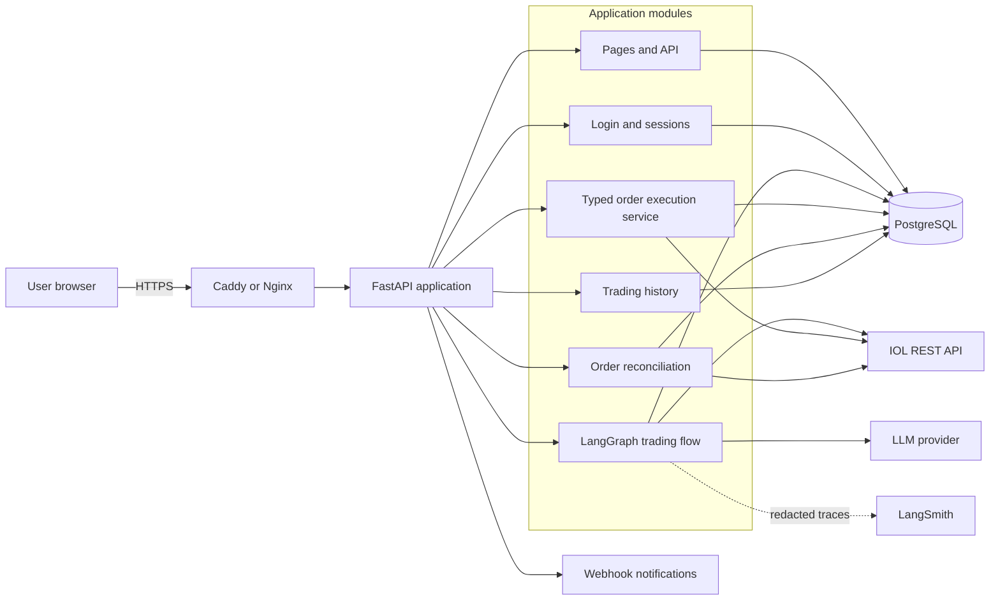
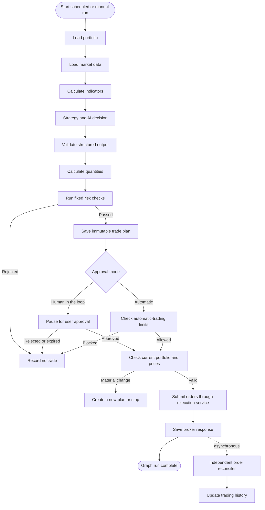
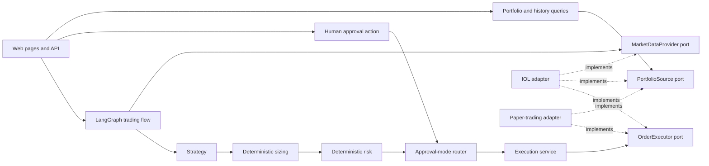
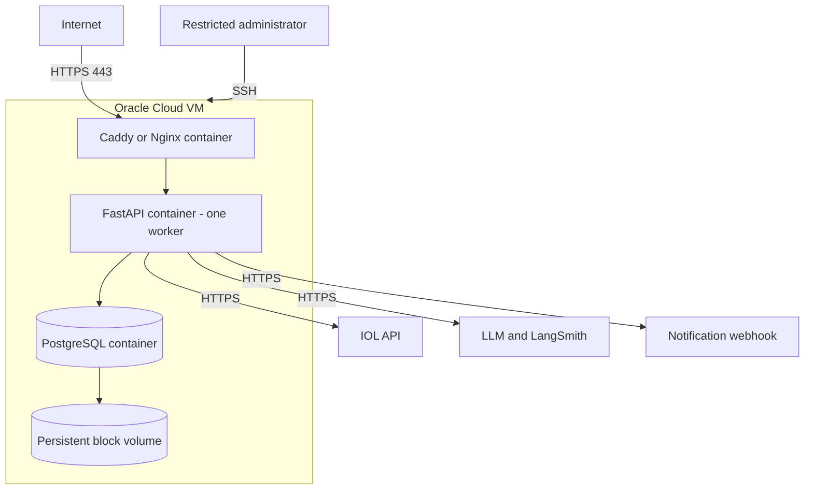

# ia-trading-broker

An automated portfolio-trading application for InvertirOnline (IOL), built with LangGraph.

The application reads a user's portfolio and market data, decides what to buy, sell, or hold, applies fixed risk rules, and can place orders through IOL. Each strategy has a configurable approval mode: **human in the loop** or **automatic execution**. The first release proves both modes with paper trading. Real IOL order submission stays disabled until the integration and recovery rules are proven.

> This project is in the planning and initial implementation stage. It is not ready for live trading.

## Main goals

- Secure application login for multiple users.
- One encrypted IOL connection per user.
- Live and paper portfolio views.
- Weekly portfolio analysis with a rule-based strategy and an optional LLM.
- Clear reasons, evidence, and risk results for every trading decision.
- Configurable `HUMAN_IN_THE_LOOP` and `AUTOMATIC` approval modes.
- Order placement from the LangGraph flow after approval or automatic-mode checks.
- Persistent paper trading with cash, positions, orders, and fills.
- A private trading-history log for each user.
- Safe recovery after restarts and duplicate requests.
- Deployment on one Oracle Cloud Infrastructure node.

## Safety rules

- LangGraph can place orders, but only through the typed execution service and IOL adapter.
- The LLM never receives IOL credentials and cannot build raw broker payloads.
- Normal Python code calculates quantities and enforces risk rules in both approval modes.
- In `HUMAN_IN_THE_LOOP` mode, approval is all-or-nothing and expires after 24 hours.
- In `AUTOMATIC` mode, the flow can continue without a person only after all risk and live-trading checks pass.
- Changed prices, cash, or positions can stop either mode before submission.
- Real trading and automatic live trading are off by default and have separate kill switches.
- Order submission is idempotent: retries must not create duplicate orders.
- An unclear broker response is never retried automatically.
- PostgreSQL is the source of truth for approvals, orders, history, and recovery.
- Secrets and full account snapshots must not appear in logs or LangSmith traces.

## Planned user flow

1. Log in to the application.
2. Connect and test an IOL account.
3. View the live or paper portfolio.
4. Start a weekly analysis.
5. Review BUY, SELL, and HOLD recommendations.
6. Choose `HUMAN_IN_THE_LOOP` or `AUTOMATIC` for the strategy.
7. In human mode, approve or reject the complete proposal. In automatic mode, let the graph continue after risk checks.
8. Let LangGraph call the paper or IOL execution service.
9. Follow order status and fills.
10. Review all activity in the personal trading-history page.

## Technology stack

| Area | Technology | Purpose |
|---|---|---|
| Language | Python 3.12 | Application and trading logic |
| Web application | FastAPI | HTML pages, API routes, authentication, and health checks |
| Frontend | Jinja2 templates, HTML, CSS, and small JavaScript | Server-rendered MVP interface |
| Agent workflow | LangGraph | Analysis, configurable approval routing, and order-submission orchestration |
| AI observability | LangSmith | Redacted model and workflow traces |
| Database | PostgreSQL | Users, sessions, portfolios, proposals, approvals, orders, and history |
| ORM and migrations | SQLAlchemy 2 and Alembic | Database access and controlled schema changes |
| Validation/configuration | Pydantic and Pydantic Settings | Typed data models and environment configuration |
| HTTP client | `httpx` | Asynchronous IOL and webhook requests |
| Authentication | Argon2id and server-side sessions | Password hashing and secure application login |
| Testing | `pytest` | Unit, integration, security, workflow, and browser-flow tests |
| Packaging/deployment | Docker and Docker Compose | Repeatable local and OCI environments |
| HTTPS proxy | Caddy or Nginx | TLS termination and secure routing |
| Hosting | Oracle Cloud Infrastructure | Single-node MVP deployment |
| Broker integration | IOL REST API | Account, portfolio, market data, and order operations |

React is not required for the first week. The application keeps its web/API boundary clear so a React frontend can be added later without changing strategy, risk, approval, or execution services.

## Architecture

The MVP uses one repository, one FastAPI process, and one PostgreSQL database.

### System context



### LangGraph trading flow

The graph supports two independent settings:

- `approval_mode`: `HUMAN_IN_THE_LOOP` or `AUTOMATIC`.
- `execution_mode`: `PAPER` or `LIVE`.

In human mode, LangGraph pauses with a durable interrupt and resumes after the user approves. In automatic mode, it follows the automatic branch. Both branches must pass the same deterministic risk and pre-submit checks. The submit node calls the typed execution service; the IOL adapter keeps credentials and broker payloads outside model context.



### Main application boundaries



### OCI deployment



### Important boundary

This is an automated trading system, not only a recommendation system. LangGraph owns the trading workflow and may reach the order-submission node in either configured mode. The graph calls a deterministic execution service, which then calls the IOL adapter.

The LLM can help make the trading decision, but it never receives IOL credentials, raw bearer tokens, or permission to bypass risk rules. Only the IOL adapter creates the provider payload and holds broker authentication.

## Frontend pages

The first frontend will include:

- Login
- Dashboard
- IOL connection setup
- Live and paper portfolios
- New weekly analysis
- Analysis status
- Strategy settings for human-in-the-loop or automatic mode
- Proposal review and approval for human mode
- Automatic-run status and safety controls
- Trading history with filters
- Trade and order details
- Operations view for failed runs and unknown orders

A separate React application is not required for the one-week MVP. The backend exposes clear service and API boundaries so React can replace the template frontend later without changing trading logic.

## Trading history

Each user will have a private, chronological log containing:

- Analysis started, completed, or failed.
- Trade plan created, automatically authorized, manually approved, rejected, or expired.
- Approval mode, execution mode, recommendations, and risk results.
- Order prepared, submitted, accepted, unknown, filled, rejected, or cancelled.
- Paper fills and paper-portfolio changes.

History records are append-only during normal operation. Every history query is restricted by `user_id`, and sensitive credentials or raw tokens are never stored in the log.

## Broker boundaries

IOL-specific details stay inside the IOL adapter. The rest of the application uses neutral models for:

- Instruments
- Account and market snapshots
- Recommendations
- Proposal versions
- Order intents
- Broker order IDs
- Order events

There is no IBKR implementation in the MVP. A future broker should implement the existing portfolio, market-data, and order-execution ports without changing strategy, risk, or approval logic.

## Repository status

The repository currently contains architecture and implementation plans under `docs/`. Application code, Docker configuration, migrations, and setup commands have not been added yet.

Planned structure:

```text README.md
app/
  api/
  domain/
  workflows/
  services/
  ports/
  infrastructure/
    iol/
    simulation/
    persistence/
    notifications/
templates/
static/
tests/
alembic/
docs/
docker-compose.yml
```

## Documentation

- [Final implementation plan](docs/final_plan.md)
- [Original plan](docs/plan.md)
- [Architecture review](docs/PLAN_REVIEW.md)

The README reflects the latest product direction, including automatic execution. The detailed final plan still needs to be synchronized with this two-mode LangGraph design before implementation starts. The original plan and review are kept to explain earlier architectural decisions.

## Development roadmap

### Day 1

Create the application, secure login, basic frontend layout, IOL connection page, and read-only portfolio.

### Day 2

Add normalized portfolio and market data, the paper ledger, and portfolio pages.

### Day 3

Add the rule-based strategy, sizing, risk checks, LangGraph analysis, and proposal pages.

### Day 4

Add human-in-the-loop and automatic graph branches, paper execution, reconciliation, notifications, and trading history.

### Day 5

Add the optional LLM, deploy to OCI, complete the browser workflow, and investigate IOL order behavior. Live order submission remains disabled if any behavior is unclear.

## Running the project

There are no working installation or startup commands yet because the application has not been bootstrapped. Once the initial project files exist, this section should document:

- Local prerequisites.
- Environment variables.
- Database migrations.
- Admin-user creation.
- Docker Compose startup.
- Test commands.
- Paper-trading setup.
- OCI deployment.

Do not add real credentials to source control. Future local configuration must use an ignored `.env` file based on a committed `.env.example`.

## Security

Do not report security problems in a public issue. Contact the repository owner privately.

Never commit:

- IOL usernames or passwords.
- IOL bearer tokens.
- LLM API keys.
- Session secrets.
- Credential-encryption keys.
- Database backups containing user data.
- Postman collections modified with real credentials.

## Disclaimer

This is automated trading software and can place orders when live execution is enabled. It does not guarantee returns and is not financial advice. Trading can result in loss. Keep automatic live trading disabled until all safety gates pass and an authorized operator has reviewed the deployment.
