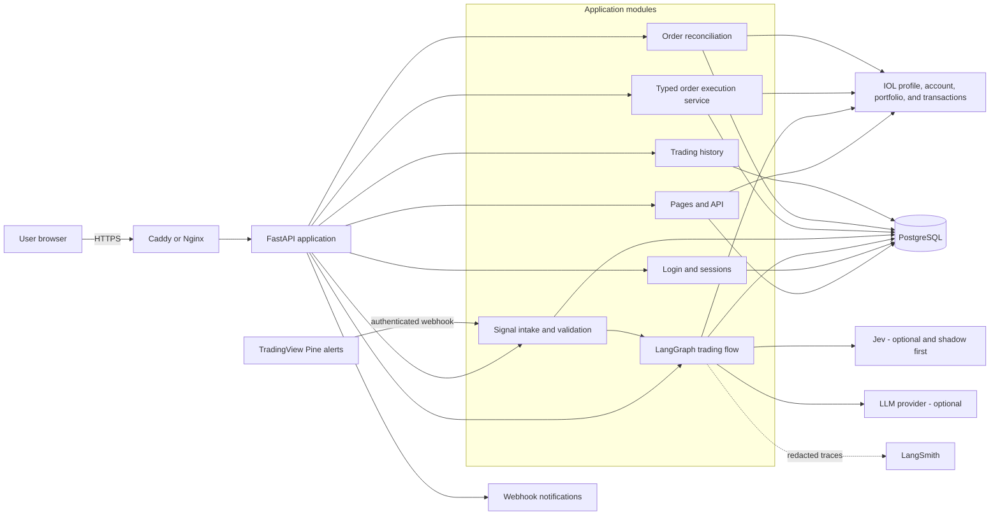
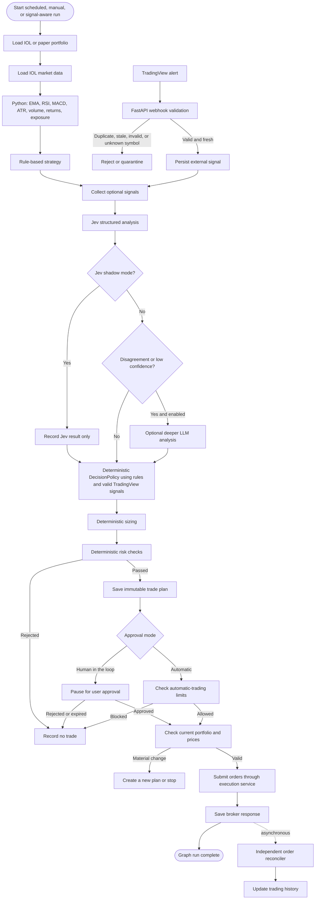
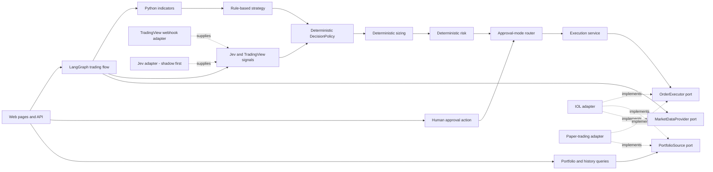
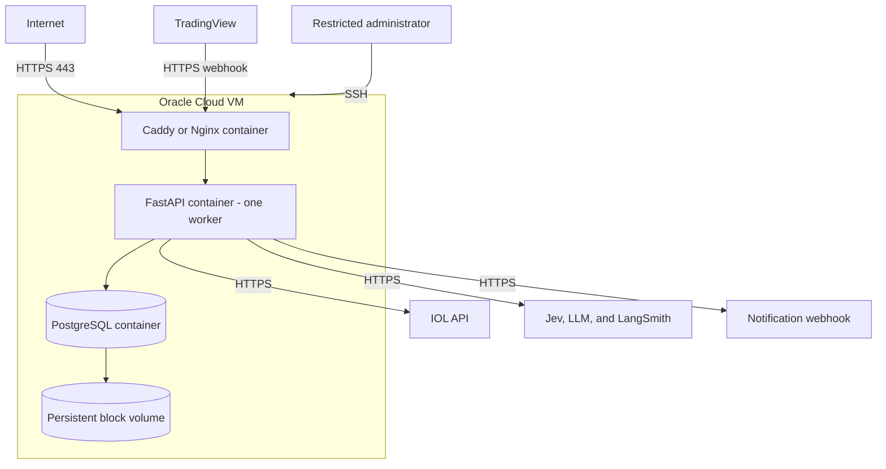

# ia-trading-broker

An automated portfolio-trading application for InvertirOnline (IOL), built with LangGraph.

The application reads a user's portfolio and market data, decides what to buy, sell, or hold, applies fixed risk rules, and can place orders through IOL. Each strategy has a configurable approval mode: **human in the loop** or **automatic execution**. The first release proves both modes with paper trading. Real IOL order submission stays disabled until the integration and recovery rules are proven.

> This project is in the planning and initial implementation stage. It is not ready for live trading.

## Main goals

- Secure application login for multiple users.
- One encrypted IOL connection per user.
- IOL profile, account status, and country portfolio views.
- Live and paper portfolio views.
- IOL transaction history and local trading-event history.
- An automatic-trading monitor showing runs, decisions, orders, health, and safety controls.
- Weekly portfolio analysis with a rule-based strategy and an optional LLM.
- Optional Jev analysis and TradingView webhook signals.
- Clear reasons, evidence, and risk results for every trading decision.
- Configurable `HUMAN_IN_THE_LOOP` and `AUTOMATIC` approval modes.
- Order placement from the LangGraph flow after approval or automatic-mode checks.
- Persistent paper trading with cash, positions, orders, and fills.
- A private trading-history log for each user.
- Safe recovery after restarts and duplicate requests.
- Deployment on one Oracle Cloud Infrastructure node.

## Safety rules

- LangGraph can place orders, but only through the typed execution service and IOL adapter.
- IOL credentials never go to Jev, an LLM, TradingView, or another analysis provider.
- TradingView never calls the order executor or IOL directly.
- Python calculates EMA, RSI, MACD, ATR, volume features, returns, and portfolio exposure before calling Jev or an LLM.
- Jev and the LLM cannot calculate final position size, set risk limits, build order payloads, or execute trades.
- Deterministic Python combines signals through `DecisionPolicy`, calculates quantities, and enforces risk rules in both approval modes.
- Jev starts in shadow mode: its decisions are recorded but cannot affect execution.
- Duplicate, stale, invalid, unauthenticated, or unknown-symbol TradingView webhooks are rejected or quarantined safely.
- In `HUMAN_IN_THE_LOOP` mode, approval is all-or-nothing and expires after 24 hours.
- In `AUTOMATIC` mode, the flow can continue without a person only after all risk and live-trading checks pass.
- Changed prices, cash, or positions can stop either mode before submission.
- Real trading and automatic live trading are off by default and have separate kill switches.
- Order submission is idempotent: retries must not create duplicate orders.
- An unclear broker response is never retried automatically.
- PostgreSQL is the source of truth for approvals, orders, history, and recovery.
- Secrets and full account snapshots must not appear in logs or LangSmith traces.

## Planned user flow

1. Log in to the application.
2. Connect and test an IOL account.
3. View the IOL profile, account status, and portfolio for the selected country.
4. Review IOL transactions and the application's full trading history.
5. Start a weekly analysis or open the automatic-trading monitor.
6. Review BUY, SELL, and HOLD recommendations.
7. Choose `HUMAN_IN_THE_LOOP` or `AUTOMATIC` for the strategy.
8. In human mode, approve or reject the complete proposal. In automatic mode, let the graph continue after risk checks.
9. Let LangGraph call the paper or IOL execution service.
10. Follow automatic runs, order status, fills, warnings, and kill-switch state.
11. Review all activity in the personal trading-history page.

## Technology stack

| Area | Technology | Purpose |
|---|---|---|
| Language | Python 3.12 | Application and trading logic |
| Web application | FastAPI | HTML pages, API routes, authentication, and health checks |
| Frontend | Jinja2 templates, HTML, CSS, and small JavaScript | Server-rendered MVP interface |
| Agent workflow | LangGraph | Analysis, signal collection, approval routing, and order-submission orchestration |
| Optional analysis | Jev | Structured BUY/HOLD/SELL, regime, confidence, and probabilities; shadow mode first |
| External signals | TradingView and Pine Script webhooks | Optional authenticated alerts persisted before graph processing |
| AI observability | LangSmith | Redacted model and workflow traces |
| Database | PostgreSQL | Users, sessions, portfolios, proposals, approvals, orders, and history |
| ORM and migrations | SQLAlchemy 2 and Alembic | Database access and controlled schema changes |
| Validation/configuration | Pydantic and Pydantic Settings | Typed data models and environment configuration |
| HTTP client | `httpx` | Asynchronous IOL and webhook requests |
| Authentication | Argon2id and server-side sessions | Password hashing and secure application login |
| Testing | `pytest` | Unit, integration, security, workflow, and browser-flow tests |
| Packaging/deployment | Docker and Docker Compose | Repeatable local and OCI environments |
| HTTPS proxy | Caddy or Nginx | TLS termination and secure routing |
| Hosting | Oracle Cloud Infrastructure | Single-node MVP deployment |
| Broker integration | IOL REST API | Profile, account status, country portfolios, transactions, market data, and orders |

React is not required for the first week. The application keeps its web/API boundary clear so a React frontend can be added later without changing strategy, risk, approval, or execution services.

## Architecture

The MVP uses one repository, one FastAPI process, and one PostgreSQL database.

### System context



### LangGraph trading flow

The graph supports two independent settings:

- `approval_mode`: `HUMAN_IN_THE_LOOP` or `AUTOMATIC`.
- `execution_mode`: `PAPER` or `LIVE`.

In human mode, LangGraph pauses with a durable interrupt and resumes after the user approves. In automatic mode, it follows the automatic branch. Both branches must pass the same deterministic risk and pre-submit checks. The submit node calls the typed execution service; the IOL adapter keeps credentials and broker payloads outside every AI context.

Python first calculates EMA, RSI, MACD, ATR, volume features, returns, and portfolio exposure. The rule-based strategy uses that normalized state. Jev may inspect the same state and return structured BUY/HOLD/SELL, market regime, confidence, and probabilities. Jev starts in shadow mode, so its result is stored for evaluation but does not affect the executable decision. TradingView signals are optional persisted inputs. Later, when Jev is active, disagreement with the rules or low confidence may route to a deeper LLM analysis. A deterministic `DecisionPolicy` creates the final decision before sizing and risk.



### Main application boundaries



### OCI deployment



### Important boundary

This is an automated trading system, not only a recommendation system. LangGraph owns the trading workflow and may reach the order-submission node in either configured mode. The graph calls a deterministic execution service, which then calls the IOL adapter.

Jev and the LLM can help make the trading decision, but neither receives IOL credentials, raw bearer tokens, or permission to bypass `DecisionPolicy`, sizing, or risk. TradingView only supplies signals through a validated webhook. Only the typed execution service can reach the IOL adapter, and only that adapter creates IOL payloads and holds broker authentication.

## Frontend pages

The first frontend will include:

- **Login** — secure application login.
- **Dashboard** — account summary, portfolio value, recent transactions, and automatic-trading status.
- **IOL connection** — save and test encrypted credentials.
- **My IOL profile** — safe fields from `GET /api/v2/datos-perfil`; never show credentials or tokens.
- **Account status** — balances and account information from `GET /api/v2/estadocuenta`, with source and refresh time.
- **Country portfolio** — positions from `GET /api/v2/portafolio/{pais}`, with a validated country selector.
- **Paper portfolio** — paper cash, positions, value, and fills.
- **Transaction history** — IOL operations plus local proposals, approvals, orders, fills, cancellations, and failures. Show source, paper/live mode, filters, and detail views.
- **New weekly analysis** — manual analysis settings.
- **Analysis status** — current node, progress, result, or safe error.
- **Strategy settings** — human-in-the-loop or automatic mode, paper/live mode, schedule, limits, and allowlist.
- **Proposal review** — evidence, decision, quantities, risks, and approval controls for human mode.
- **Automatic trading monitor** — enabled/disabled state, paper/live state, next and last run, current graph node, last heartbeat, latest decision, active orders, fills, rejected risk checks, stale-data warnings, failures, and reconciliation status.
- **Automatic trading controls** — pause/resume paper automation, disable automatic execution, and activate the live kill switch. Enabling live automatic trading requires a separate protected action and remains off by default.
- **Jev evaluation** — shadow-mode results and comparison with the rule-based decision.
- **TradingView signals** — accepted, duplicate, stale, invalid, and unknown-symbol alerts.
- **Trade/order detail** — proposal, approval route, broker ID, and all status events.
- **Operations** — failed runs and unknown orders for authorized users.

Profile, account, portfolio, transaction, and automatic-monitor pages display the latest stored snapshot immediately. A user can request a refresh, which calls IOL through the backend and stores a new timestamped snapshot. A failed refresh must keep the last snapshot visible and mark it stale; it must not erase known data.

A separate React application is not required for the one-week MVP. The backend exposes clear service and API boundaries so React can replace the template frontend later without changing trading logic.

## Trading history

Each user will have a private, chronological view that combines two clearly labeled sources:

- **IOL transaction history:** normalized operations returned by verified IOL order/operation endpoints.
- **Application trading history:** the append-only local audit log.

The local log contains:

- Analysis started, completed, or failed.
- Trade plan created, automatically authorized, manually approved, rejected, or expired.
- Approval mode, execution mode, and rule-based recommendations.
- Jev shadow/active output, accepted or rejected TradingView signals, optional LLM output, final `DecisionPolicy`, and risk results.
- Order prepared, submitted, accepted, unknown, filled, rejected, or cancelled.
- Paper fills and paper-portfolio changes.

History records are append-only during normal operation. Imported IOL transactions are upserted by broker connection and opaque broker operation ID so refreshes do not create duplicates. Every query is restricted by `user_id`, and sensitive credentials, raw tokens, or unsafe provider payloads are never stored in the visible log.

## Broker boundaries

IOL-specific details stay inside the IOL adapter. The rest of the application uses neutral models for:

- Instruments
- Account and market snapshots
- Recommendations
- Proposal versions
- Order intents
- Broker order IDs
- Order events

There is no IBKR implementation in the MVP. A future broker should implement the existing portfolio, market-data, and order-execution ports without changing strategy, risk, or approval logic.

## Repository status

The repository currently contains architecture and implementation plans under `docs/`. Application code, Docker configuration, migrations, and setup commands have not been added yet.

Planned structure:

```text README.md
app/
  api/
  domain/
  workflows/
  services/
  ports/
  infrastructure/
    iol/
    jev/
    tradingview/
    simulation/
    persistence/
    notifications/
templates/
static/
tests/
alembic/
docs/
docker-compose.yml
```

## Documentation

- [Final implementation plan](docs/final_plan.md)
- [Original plan](docs/plan.md)
- [Architecture review](docs/PLAN_REVIEW.md)

The README reflects the latest product direction, including automatic execution, optional Jev analysis, TradingView signals, IOL account views, transaction history, and automatic-trading monitoring. `docs/final_plan.md` includes the account/history/monitor pages, but its older mandatory-approval and shorter LangGraph sections still need to be synchronized with the README's two-mode execution design before implementation starts. The original plan and review are kept to explain earlier architectural decisions.

## Development roadmap

### Day 1

Create the application, secure login, basic frontend layout, and IOL connection page. Add read-only IOL profile (`/datos-perfil`), account status (`/estadocuenta`), and country portfolio (`/portafolio/{pais}`) adapters and pages with timestamped snapshots.

### Day 2

Add normalized portfolio and market data, the paper ledger, portfolio pages, and Python indicators: EMA, RSI, MACD, ATR, volume, returns, and exposure.

### Day 3

Add the rule-based strategy, deterministic `DecisionPolicy`, sizing, risk checks, LangGraph flow, and proposal pages. Define the structured signal schema shared by Jev and TradingView.

### Day 4

Add human-in-the-loop and automatic graph branches, paper execution, reconciliation, and notifications. Build the combined IOL transaction/application history and the automatic-trading monitor with run state, heartbeat, decisions, orders, warnings, failures, reconciliation, and protected pause/kill controls. Add the authenticated TradingView webhook with duplicate, freshness, payload, and symbol validation.

### Day 5

Add Jev in shadow mode and store its structured decisions for evaluation. Add optional deeper LLM routing without allowing Jev, TradingView, or the LLM to bypass `DecisionPolicy`, sizing, or risk. Deploy to OCI, complete the browser workflow, and investigate IOL order behavior. Live order submission remains disabled if any behavior is unclear.

### After the first MVP

Evaluate Jev shadow results against the rule-based strategy and paper outcomes. Only after explicit acceptance may `DecisionPolicy` use Jev as an active input. If Jev and the rules disagree or confidence is low, the graph may request deeper LLM analysis. TradingView remains an input signal and never becomes an execution trigger.

## Running the project

There are no working installation or startup commands yet because the application has not been bootstrapped. Once the initial project files exist, this section should document:

- Local prerequisites.
- Environment variables.
- Database migrations.
- Admin-user creation.
- Docker Compose startup.
- Test commands.
- Paper-trading setup.
- IOL profile, account, portfolio, and transaction refresh.
- Automatic-trading monitor and safety controls.
- OCI deployment.

Do not add real credentials to source control. Future local configuration must use an ignored `.env` file based on a committed `.env.example`.

## Security

Do not report security problems in a public issue. Contact the repository owner privately.

Never commit:

- IOL usernames or passwords.
- IOL bearer tokens.
- Unredacted profile, account, portfolio, or transaction API responses.
- Jev or LLM API keys.
- TradingView webhook secrets.
- Session secrets.
- Credential-encryption keys.
- Database backups containing user data.
- Postman collections modified with real credentials.

## Disclaimer

This is automated trading software and can place orders when live execution is enabled. It does not guarantee returns and is not financial advice. Trading can result in loss. Keep automatic live trading disabled until all safety gates pass and an authorized operator has reviewed the deployment.
