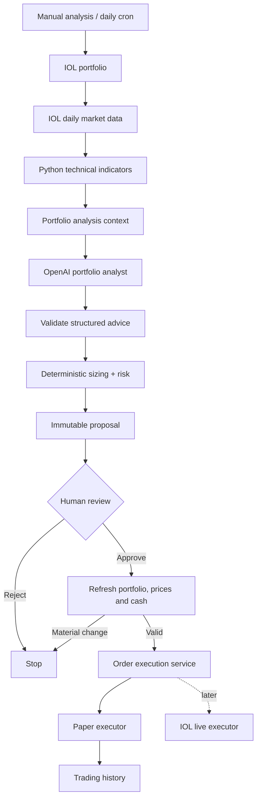
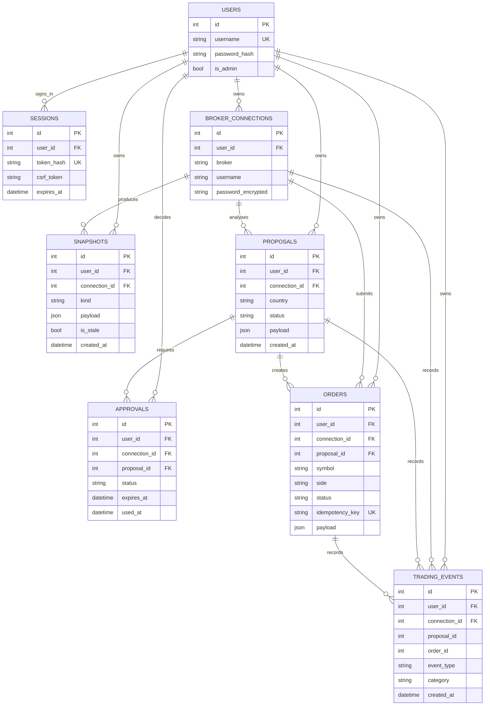

# ia-trading-broker

Daily portfolio analysis and human-approved trading for InvertirOnline (IOL), with an OpenAI model as the primary portfolio analyst.

The application wraps the IOL API, reads the user's existing portfolio, loads daily market data, calculates technical evidence in Python, asks an OpenAI model what to **BUY, HOLD, or SELL**, validates the result, creates an immutable proposal, and waits for human approval before executing anything.

The first production target is deliberately narrow:

> **One portfolio analysis per trading day, one structured recommendation set, and no execution without explicit human approval.**

There is no intraday trading, no automatic approval, and no automatic live trading in this version.

---

# 1. Product goal



The model advises. Python validates, sizes, applies hard limits, and controls execution.

---

# 2. What stays from the existing repository

Do **not** restart the project from zero.

The following parts are already useful and should remain:

- FastAPI application.
- Login, sessions, CSRF protection, and user isolation.
- PostgreSQL persistence.
- Encrypted IOL connections.
- IOL authentication and token refresh.
- IOL profile, account-status, portfolio, quote, and price-history reads.
- IOL call-budget protection.
- Broker-independent portfolio/domain models.
- Exact `Money` handling.
- EMA, RSI, MACD, ATR, volume, returns, and portfolio-exposure calculations.
- Saved snapshots.
- Paper ledger.
- Proposal persistence.
- Approval and rejection.
- Fresh-data re-check before execution.
- Idempotent order creation.
- `OrderExecutor` abstraction.
- `PaperOrderExecutor`.
- Trading-event history.
- Existing LangGraph infrastructure.

The main architectural change is:

```text
OLD PRIMARY DECISION PATH

universe
 -> scanner
 -> technical score
 -> fundamental/news score
 -> finalists
 -> rule-based decision


NEW PRIMARY DECISION PATH

existing portfolio + allowed watchlist opportunities
 -> normalized daily market evidence
 -> OpenAI portfolio analysis
 -> deterministic validation / sizing / risk
 -> proposal
```

The existing rule-based decision may remain as a fallback for tests and temporary OpenAI failures, but it is no longer the primary decision source.

---

# 3. Core design rules

1. IOL credentials, passwords, bearer tokens, sessions, and raw private broker payloads never reach OpenAI.
2. OpenAI receives only normalized portfolio and market-analysis context.
3. The LLM returns advice, not broker requests.
4. The LLM cannot call `OrderExecutor`.
5. Hard portfolio limits and position sizing remain deterministic Python code.
6. Unknown symbols and malformed model responses are rejected before a proposal exists.
7. Every held position is analyzed even if it is not present in the configured watchlist.
8. New BUY recommendations may only target configured allowed instruments.
9. A saved proposal is immutable.
10. The complete proposal requires explicit human approval.
11. Approval is single-use and expires.
12. Portfolio, prices, holdings, and cash are refreshed before execution.
13. Orders are persisted before submission.
14. Repeated requests must never create duplicate orders.
15. Paper trading is the default and only enabled execution mode during the MVP.
16. Live execution is a later capability behind the same `OrderExecutor` port.
17. One OpenAI call analyzes the portfolio as a whole; do not call the model once per asset.
18. Multi-agent analysis is postponed until one portfolio analyst proves insufficient.

---

# 4. Target analysis scope

The **existing IOL portfolio is the center of every run**.

For every held position, the analysis context should contain, when available:

```text
symbol
name
category
quantity
available quantity
average cost
current price
market value
portfolio weight
unrealized gain/loss
EMA
RSI
MACD
ATR
volume
recent returns
data timestamp
missing/stale-data warnings
```

Portfolio-level context should contain:

```text
cash
total portfolio value
position concentration
portfolio limits
analysis timestamp
country
```

A configured watchlist may add a small number of possible new BUY opportunities.

The model should reason about the whole portfolio, not each instrument independently.

---

# 5. Step 0 — Remove or retire obsolete architecture

No database table needs to be dropped.

The existing persistence model is compatible with the new workflow and should be reused.

## 5.1 Remove from the active decision path

The following concepts should stop being part of the main analysis pipeline:

```text
market scanner as mandatory first stage
10-12 candidate funnel
technical ranking as a required selection gate
fundamental/news deterministic placeholder as a required stage
finalist selection
Jev
TradingView
automatic execution branch
```

Do not delete unrelated working infrastructure simply because it is not currently used.

## 5.2 Classes/code to retire or simplify

After checking references and tests, deprecate or remove the following **if they exist only for the old funnel**:

```text
CandidateView
FinalistView
FundamentalAnalyzer
DeterministicFundamentals
candidate/finalist scoring code
mandatory market-scanner selection code
funnel-specific combined-score code
```

If `app/domain/portfolio_selection.py` exists only to implement the old funnel, remove it after the new analysis path is covered by tests.

Keep `config/universe.toml`, but change its responsibility from:

```text
mandatory 34 -> 10-12 -> ~5 funnel
```

to:

```text
watchlist + allowed new instruments + portfolio constraints
```

## 5.3 Keep these old concepts

Do **not** remove:

```text
Proposal
Recommendation
RiskCheck
Approval
Order
OrderResult
TradingEvent
PaperLedger
PaperPosition
Portfolio
Position
Money
IndicatorEvidence
OrderExecutor
PaperOrderExecutor
```

## 5.4 Migration rule

Do not perform a large deletion first.

Use this sequence:

```text
1. introduce the new PortfolioAdvisor path
2. migrate tests
3. switch the graph to the new path
4. verify end-to-end paper flow
5. remove code that has no remaining references
```

**Done when:** there is one clear primary analysis path and the old funnel is either removed or isolated as unused legacy code.

---

# 6. Target class model

```mermaid
classDiagram

    class Portfolio {
        +str country
        +Money cash
        +list~Position~ positions
        +Money total_value()
        +Position? position_for(symbol)
    }

    class Position {
        +str symbol
        +str name
        +str category
        +Decimal quantity
        +Decimal available_quantity
        +Money? average_cost
        +Money current_price
        +Money market_value
        +float weight
    }

    class IndicatorEvidence {
        +str symbol
        +Money last_price
        +float? ema_fast
        +float? ema_slow
        +float? rsi
        +float? macd_histogram
        +float? atr
        +float? average_volume
        +float? return_fraction
        +int observations
        +bool stale
    }

    class PortfolioAnalysisContext {
        +str country
        +datetime analysed_at
        +Portfolio portfolio
        +list~IndicatorEvidence~ evidence
        +list~AllowedInstrument~ watchlist
        +PortfolioConstraints constraints
        +list~str~ warnings
    }

    class AllowedInstrument {
        +str symbol
        +str name
        +str category
    }

    class PortfolioConstraints {
        +int max_open_positions
        +float max_single_position_pct
        +float min_cash_pct
        +int max_trades_per_run
        +dict category_caps
    }

    class AssetAdvice {
        +str symbol
        +Action action
        +float confidence
        +str rationale
        +list~str~ risks
    }

    class PortfolioAdvice {
        +str summary
        +list~AssetAdvice~ decisions
        +str model_provider
        +str model_name
        +str analysis_version
    }

    class PortfolioAdvisor {
        <<port>>
        +analyze(PortfolioAnalysisContext) PortfolioAdvice
    }

    class OpenAIPortfolioAdvisor {
        +analyze(PortfolioAnalysisContext) PortfolioAdvice
    }

    class DeterministicPortfolioAdvisor {
        +analyze(PortfolioAnalysisContext) PortfolioAdvice
    }

    class Recommendation {
        +str symbol
        +Action action
        +Decimal quantity
        +Money limit_price
        +Money notional
        +float weight_after
        +str rationale
        +IndicatorEvidence evidence
        +list~RiskCheck~ risk_checks
        +is_order() bool
    }

    class RiskCheck {
        +str name
        +bool passed
        +str detail
    }

    class Proposal {
        +str country
        +str status
        +Money portfolio_value
        +Money cash
        +PortfolioAdvice advice
        +list~Recommendation~ recommendations
        +list~RiskCheck~ risk_checks
        +orders() list~Recommendation~
        +passed_risk() bool
    }

    class Approval {
        +str status
        +datetime expires_at
        +datetime? used_at
    }

    class Order {
        +str symbol
        +str side
        +Decimal quantity
        +Money limit_price
        +Money notional
        +str status
        +str idempotency_key
    }

    class OrderResult {
        +str status
        +bool accepted
        +Decimal filled_quantity
        +Money filled_price
        +str? broker_order_id
    }

    class OrderExecutor {
        <<port>>
        +submit(Order) OrderResult
    }

    class PaperOrderExecutor {
        +submit(Order) OrderResult
    }

    class IOLOrderExecutor {
        +submit(Order) OrderResult
    }

    Portfolio *-- Position
    PortfolioAnalysisContext *-- Portfolio
    PortfolioAnalysisContext *-- IndicatorEvidence
    PortfolioAnalysisContext *-- AllowedInstrument
    PortfolioAnalysisContext *-- PortfolioConstraints

    PortfolioAdvice *-- AssetAdvice
    Proposal *-- PortfolioAdvice
    Proposal *-- Recommendation
    Recommendation *-- IndicatorEvidence
    Recommendation *-- RiskCheck
    Proposal *-- RiskCheck

    PortfolioAdvisor <|.. OpenAIPortfolioAdvisor
    PortfolioAdvisor <|.. DeterministicPortfolioAdvisor

    Proposal --> Approval
    Proposal --> Order

    OrderExecutor <|.. PaperOrderExecutor
    OrderExecutor <|.. IOLOrderExecutor

    Order --> OrderResult
```



## Important class-model decisions

### `PortfolioAdvisor`

This is the only analysis port the graph needs for the MVP.

```python
class PortfolioAdvisor(Protocol):
    async def analyze(
        self,
        context: PortfolioAnalysisContext,
    ) -> PortfolioAdvice:
        ...
```

### `OpenAIPortfolioAdvisor`

The production implementation.

It:

- builds the model request;
- calls OpenAI;
- requests structured output;
- validates the returned schema;
- returns `PortfolioAdvice`.

It does **not**:

- authenticate to IOL;
- calculate order quantity;
- bypass portfolio limits;
- create orders;
- execute trades.

### `DeterministicPortfolioAdvisor`

Optional fallback/test implementation.

It may wrap the current rule-based decision logic so tests can run without OpenAI and a temporary model outage does not require inventing recommendations.

---

# 7. Target database model

No new table is required for the MVP.

The current tables can store the new model-backed workflow.



## Snapshot kinds

Continue using `snapshots.kind` to identify the JSON payload:

```text
profile
account_status
portfolio:{country}
price_history:{SYMBOL}
paper_ledger:{country}
analysis_context:{country}
```

`analysis_context:{country}` is optional. Add it only if retaining the exact normalized model input is useful for auditing.

## Proposal payload

`proposals.payload` should contain the immutable object that was shown to the user, including:

```text
analysis timestamp
portfolio snapshot reference
market-data timestamp
model provider
model name
analysis version
portfolio advice
recommendations
risk checks
warnings
```

There is no need for a separate `llm_analyses` table in the MVP.

If later querying model-specific fields becomes operationally important, those fields can be normalized into columns or a dedicated table through an explicit migration.

---

# 8. Target folder structure and responsibilities

```text
app/
│
├── api/
│   ├── auth.py
│   ├── broker.py
│   ├── portfolio.py
│   ├── analysis.py
│   ├── proposals.py
│   ├── history.py
│   └── ...
│
├── domain/
│   ├── money.py
│   ├── portfolio.py
│   ├── indicators.py
│   ├── analysis.py
│   └── trading.py
│
├── ports/
│   ├── portfolio_source.py
│   ├── market_data_provider.py
│   ├── portfolio_advisor.py
│   └── order_executor.py
│
├── services/
│   ├── broker.py
│   ├── portfolio_analysis.py
│   ├── indicators.py
│   ├── policy.py
│   ├── proposals.py
│   ├── approvals.py
│   ├── orders.py
│   ├── execution.py
│   ├── events.py
│   └── ledger.py
│
├── workflows/
│   └── trading_flow.py
│
├── infrastructure/
│   ├── iol/
│   │   ├── client.py
│   │   ├── adapter.py
│   │   ├── schemas.py
│   │   ├── auth.py
│   │   └── call_budget.py
│   │
│   ├── openai/
│   │   ├── client.py
│   │   ├── portfolio_advisor.py
│   │   └── prompts/
│   │       └── portfolio_analysis.md
│   │
│   ├── simulation/
│   │   └── paper_executor.py
│   │
│   └── persistence/
│       ├── models.py
│       ├── repositories.py
│       └── database.py
│
├── cli.py
├── config.py
└── main.py

config/
└── universe.toml

templates/
static/
tests/
docker-compose.yml
```

## Folder responsibilities

### `app/api/`

HTTP and HTML boundary only.

Responsibilities:

- validate requests/forms;
- authentication and authorization;
- call application services/workflows;
- render templates or API responses.

It should not contain trading strategy logic.

### `app/domain/`

Pure business types and calculations.

Responsibilities:

- `Money`;
- portfolio and position models;
- indicators;
- OpenAI analysis input/output contracts;
- recommendations;
- proposals;
- risk checks;
- orders.

No HTTP, database, OpenAI, or IOL code belongs here.

### `app/ports/`

Interfaces toward external systems.

Primary ports:

```text
PortfolioSource
MarketDataProvider
PortfolioAdvisor
OrderExecutor
```

Application services depend on ports, not concrete external providers.

### `app/services/`

Use cases and deterministic business logic.

Responsibilities:

- build normalized portfolio context;
- calculate indicators;
- validate model decisions;
- deterministic sizing;
- portfolio risk limits;
- create proposals;
- approvals;
- orders;
- execution orchestration;
- paper ledger;
- trading events.

### `app/workflows/`

LangGraph orchestration only.

The workflow coordinates services and persists workflow outcomes.

It should not contain indicator formulas, OpenAI HTTP code, IOL request construction, or order-sizing formulas.

### `app/infrastructure/iol/`

Everything specific to IOL.

Responsibilities:

- authentication;
- tokens;
- REST requests;
- schemas;
- mapping raw IOL responses into domain models;
- call budget;
- safe read retries.

Raw IOL payload formats must not escape this boundary.

### `app/infrastructure/openai/`

Everything specific to OpenAI.

Responsibilities:

- OpenAI client;
- model configuration;
- structured-output request;
- prompt templates;
- parsing/validation into domain `PortfolioAdvice`.

It must not contain order execution code.

### `app/infrastructure/simulation/`

Paper execution implementation.

### `app/infrastructure/persistence/`

SQLAlchemy and PostgreSQL implementation details.

### `config/universe.toml`

Data-only trading configuration.

Responsibilities:

- allowed new instruments;
- paper/display names;
- categories;
- portfolio constraints.

No API keys or secrets belong here.

---

# 9. Ten implementation steps

## Step 1 — Stabilize the IOL boundary

Reuse the existing IOL wrapper.

Confirm these reads work through typed broker-independent models:

```text
authenticate
get_profile
get_account_status
get_portfolio
get_quote
get_price_history
```

IOL-specific request/response JSON must remain inside `app/infrastructure/iol/`.

Normalize market identifiers and price-history parameters inside the adapter.

Do not make services know IOL endpoint paths.

### Tests

- portfolio fixture maps to `Portfolio`;
- quotes map to domain models;
- price history maps to normalized observations;
- stale snapshot survives IOL failure;
- token refresh does not leak credentials.

**Done when:** the rest of the codebase can work entirely with domain objects.

---

## Step 2 — Build `PortfolioAnalysisContext`

Create:

```text
app/domain/analysis.py
app/services/portfolio_analysis.py
```

Add:

```python
PortfolioAnalysisContext
AllowedInstrument
PortfolioConstraints
```

The context contains:

```text
current portfolio
cash
weights
daily technical evidence
allowed new instruments
portfolio constraints
timestamps
warnings
```

Every current holding must appear even if absent from `universe.toml`.

### Tests

- held symbol outside watchlist is included;
- watchlist-only symbol may be considered for BUY;
- invalid/duplicate watchlist symbol is rejected;
- stale/missing market data becomes a warning rather than fabricated evidence.

**Done when:** one typed object fully describes what OpenAI is allowed to analyze.

---

## Step 3 — Normalize daily market evidence

Reuse the existing:

```text
EMA
RSI
MACD
ATR
volume
returns
exposure
```

Ensure the analysis uses **daily observations**, not accidental intraday rows.

Store or calculate:

```text
last_price
EMA fast
EMA slow
RSI
MACD histogram
ATR
average volume
recent return
observation count
stale/missing-data state
```

Do not turn all indicators into a mandatory synthetic technical score.

They are evidence supplied to the portfolio analyst and to deterministic risk code where appropriate.

### Tests

- daily normalization;
- insufficient-history behavior;
- stale history;
- deterministic indicator values.

**Done when:** every analyzed symbol has valid daily evidence or an explicit reason why evidence is missing.

---

## Step 4 — Convert `universe.toml` into watchlist + constraints

Keep centralized TOML configuration.

Example:

```toml
[[instruments]]
symbol = "YPFD"
name = "YPF"
category = "argentina_stock"

[[instruments]]
symbol = "VIST"
name = "Vista Energy"
category = "argentina_stock"

[[instruments]]
symbol = "SPY"
name = "SPDR S&P 500 ETF"
category = "cedear"

[[instruments]]
symbol = "AL30"
name = "Bono AL30"
category = "bond"

[constraints]
max_open_positions = 8
max_single_position_pct = 0.15
min_cash_pct = 0.10
max_trades_per_run = 3

[constraints.category_caps]
argentina_stock = 4
cedear = 3
bond = 2
```

The watchlist limits possible **new positions**.

Existing holdings are always reviewed.

No symbol may be hardcoded in application Python.

### Tests

- TOML validation;
- duplicate ticker detection;
- unknown category rejection;
- held non-watchlist symbol remains analyzable.

**Done when:** changing the investment universe requires only a TOML edit.

---

## Step 5 — Define the OpenAI analysis contract

Add structured domain output.

Recommended MVP action set:

```text
BUY
HOLD
SELL
```

Keep the first version small.

Example:

```python
class AssetAdvice(BaseModel):
    symbol: str
    action: Literal["BUY", "HOLD", "SELL"]
    confidence: float
    rationale: str
    risks: list[str]


class PortfolioAdvice(BaseModel):
    summary: str
    decisions: list[AssetAdvice]
    model_provider: str
    model_name: str
    analysis_version: str
```

Validation rules:

- `SELL` only makes sense for held positions;
- `BUY` must target a held position or an allowed new instrument;
- every symbol must be known;
- confidence must be within a defined range;
- duplicates are rejected;
- model output cannot provide executable quantity or broker payload.

Configuration belongs in environment settings:

```text
OPENAI_API_KEY=
OPENAI_MODEL=
OPENAI_BASE_URL=
OPENAI_TIMEOUT_SECONDS=
```

### Tests

- valid structured response;
- unknown symbol;
- unsupported action;
- duplicate decision;
- malformed response;
- missing decision fields.

**Done when:** no free-form model response can become a proposal without typed validation.

---

## Step 6 — Implement `PortfolioAdvisor`

Add:

```text
app/ports/portfolio_advisor.py
app/infrastructure/openai/client.py
app/infrastructure/openai/portfolio_advisor.py
```

Port:

```python
class PortfolioAdvisor(Protocol):
    async def analyze(
        self,
        context: PortfolioAnalysisContext,
    ) -> PortfolioAdvice:
        ...
```

The OpenAI adapter performs **one portfolio-level request per analysis**.

Input:

```text
portfolio
positions
cash
weights
daily indicators
recent returns
allowed watchlist opportunities
portfolio constraints
warnings
```

Output:

```text
portfolio summary
BUY / HOLD / SELL per relevant symbol
confidence
short rationale
risks
```

Also keep:

```text
DeterministicPortfolioAdvisor
```

as a test/offline fallback if desired.

The fallback should be explicit in the saved event/history so a user can see that OpenAI was not used.

### Tests

Use a fake OpenAI client.

Unit tests must never spend OpenAI API calls.

**Done when:** a fake structured OpenAI response becomes a typed `PortfolioAdvice`.

---

## Step 7 — Simplify the LangGraph workflow

The project already uses LangGraph. Do not migrate again.

Target graph:

```text
start
  ↓
load_portfolio
  ↓
load_market_data
  ↓
calculate_indicators
  ↓
build_analysis_context
  ↓
analyse_portfolio
  ↓
validate_and_size
  ↓
save_proposal
  ↓
request_approval
  ↓
await_approval
  ↓
recheck
  ↓
submit
  ↓
end
```

Only one AI node is needed:

```text
analyse_portfolio
```

Do not add:

```text
news agent
fundamental agent
risk agent
critic agent
TradingView agent
Jev agent
```

unless a future measured limitation justifies them.

The deterministic risk manager remains normal Python code.

### Failure behavior

If OpenAI is unavailable:

```text
option A: use deterministic fallback and mark proposal source=fallback
option B: fail the analysis and create no proposal
```

Pick one behavior explicitly in configuration. Do not silently substitute one source for another.

### Tests

- successful OpenAI run;
- malformed model output;
- OpenAI timeout;
- fallback behavior;
- restart while awaiting approval;
- no path from analyst directly to executor.

**Done when:** a manual run produces a model-backed immutable proposal.

---

## Step 8 — Reuse deterministic policy, approval, and paper execution

Map `PortfolioAdvice` into the existing recommendation and proposal path.

The LLM chooses direction.

Python chooses whether that recommendation is executable.

Example:

```text
OpenAI: BUY VIST

          ↓

Python:
- symbol allowed?
- enough cash?
- max position exceeded?
- category cap exceeded?
- max trades exceeded?
- valid price?
- data fresh enough?
- quantity?
```

A model recommendation that fails policy/risk checks remains visible as **blocked**, not silently removed.

Reuse:

```text
Recommendation
RiskCheck
Proposal
Approval
Order
OrderExecutor
PaperOrderExecutor
TradingEvent
```

Approval continues to cover the entire proposal.

Before submission:

```text
refresh portfolio
refresh prices
validate holdings
validate cash
validate material price change
```

Save the order before calling the executor.

### Tests

- BUY blocked by position cap;
- BUY blocked by cash;
- SELL cannot exceed owned quantity;
- repeated approval cannot duplicate an order;
- material price change blocks execution;
- rejected proposal creates no order;
- paper fill updates ledger.

**Done when:** `analyze -> review -> approve -> paper execution -> history` works end to end.

---

## Step 9 — Add once-per-day scheduling

Do not begin with an in-process scheduler.

Add a CLI command such as:

```bash
python -m app.cli analyze --connection 1 --country argentina
```

Then run it from OS cron.

The CLI must call the same application workflow as the web button.

Idempotency rule:

```text
at most one scheduled proposal
per connection
per country
per trading date
```

A daily scheduled run:

```text
refresh
 -> analyze
 -> save proposal
 -> notify/log
 -> wait for human approval
```

It must never approve its own proposal.

If yesterday's proposal is still pending, define one explicit policy.

Recommended MVP:

```text
expire previous pending proposal
create today's proposal
```

### Tests

- duplicate cron invocation;
- pending previous proposal;
- disabled connection;
- failed IOL refresh;
- OpenAI failure;
- scheduled proposal waits for approval.

**Done when:** cron can run twice accidentally without generating two daily proposals.

---

## Step 10 — Validate the daily paper product before live trading

Run the system in daily paper mode long enough to evaluate:

```text
recommendation usefulness
model consistency
OpenAI failure rate
token/API cost
IOL call usage
false BUY/SELL recommendations
blocked recommendations
stale-data frequency
approval frequency
paper portfolio results
```

Confirm the History page can reconstruct:

```text
analysis started
data loaded
OpenAI model used
portfolio advice returned
validation outcome
proposal saved
approval requested
approved/rejected/expired
fresh-data re-check
order prepared
paper fill/rejection
ledger update
```

Live IOL execution is **not part of the ten-step MVP**.

Only after daily paper trading is stable should a future implementation add `IOLOrderExecutor`.

That later work must prove:

```text
order submission
stable broker order ID
status lookup
partial fills
rejection handling
cancellation
timeouts
unknown outcomes
reconciliation
restart recovery
idempotency
live kill switch
```

**Done when:** the daily OpenAI-backed paper workflow is reliable, auditable, and useful enough to justify a separate live-trading phase.

---

# 10. Target LangGraph state

Keep graph state small.

Example:

```python
class TradingState(TypedDict):
    user_id: int
    connection_id: int
    country: str

    portfolio_snapshot_id: int | None
    analysis_context: PortfolioAnalysisContext | None
    advice: PortfolioAdvice | None

    proposal_id: int | None
    approval_id: int | None

    warnings: list[str]
    status: str
```

Do not put:

```text
IOL passwords
IOL bearer tokens
OpenAI API keys
raw broker responses
```

into graph state.

Persistent business state remains in PostgreSQL.

---

# 11. OpenAI prompt responsibility

Keep the portfolio-analysis prompt versioned in one place:

```text
app/infrastructure/openai/prompts/portfolio_analysis.md
```

The prompt should tell the model:

```text
- analyze the portfolio as a whole;
- review every existing holding;
- consider allowed watchlist instruments for new BUY opportunities;
- use only the supplied evidence;
- do not assume unavailable fundamentals/news;
- return structured BUY/HOLD/SELL decisions;
- explain the main reason and risks;
- do not calculate broker-specific order payloads;
- do not override portfolio constraints;
- do not claim execution.
```

The prompt version should be persisted in the proposal metadata, for example:

```text
analysis_version = "portfolio-v1"
```

This makes model-behavior changes auditable.

---

# 12. Testing strategy

All automated tests must run without real IOL or OpenAI calls.

Use:

```text
FakeIOL
FakePortfolioAdvisor
PaperOrderExecutor
temporary/in-memory test persistence where supported
```

Minimum test groups:

```text
domain
IOL mapping
indicator calculations
portfolio context
OpenAI structured parsing
model-output validation
deterministic sizing
risk checks
proposal persistence
approval
idempotency
fresh-data recheck
paper execution
LangGraph workflow
browser flow
daily CLI idempotency
```

Keep at least one full test:

```text
login
 -> load fake IOL portfolio
 -> run fake OpenAI analysis
 -> review proposal
 -> approve
 -> paper execute
 -> inspect History
```

---

# 13. Configuration

Secrets/environment:

```text
SECRET_KEY=
CREDENTIAL_ENCRYPTION_KEY=

DATABASE_URL=

IOL_BASE_URL=
IOL_MONTHLY_CALL_LIMIT=
IOL_CALL_WARN_RATIO=

OPENAI_API_KEY=
OPENAI_MODEL=
OPENAI_BASE_URL=
OPENAI_TIMEOUT_SECONDS=

LIVE_TRADING_ENABLED=false
```

Trading configuration:

```text
config/universe.toml
```

Do not put API keys or credentials in TOML.

---

# 14. MVP user flow

The first complete version should allow the user to:

1. Log in.
2. Connect an IOL account.
3. Refresh the current portfolio.
4. Review current holdings and cash.
5. Run a portfolio analysis manually.
6. See OpenAI BUY / HOLD / SELL recommendations and rationale.
7. See which recommendations were blocked by deterministic risk rules.
8. Review the immutable proposal.
9. Approve or reject it.
10. Execute approved orders on the paper ledger.
11. Review every step in History.
12. Later enable one scheduled daily analysis through cron.

---

# 15. Explicitly out of scope

For this version:

```text
intraday trading
automatic approval
automatic live trading
high-frequency polling
Jev
TradingView
autonomous web browsing
multi-agent debate
one-model-call-per-symbol
LLM-generated order quantities
LLM-generated broker payloads
LLM access to IOL credentials
live IOL order execution
```

These features should not be introduced while implementing Steps 0-10.

---

# 16. Final target

The project should end this implementation phase with this architecture:

```text
                   ┌─────────────────┐
                   │   Daily cron    │
                   │   or Web UI     │
                   └────────┬────────┘
                            │
                            ▼
                   ┌─────────────────┐
                   │    LangGraph    │
                   └────────┬────────┘
                            │
              ┌─────────────▼─────────────┐
              │     IOL Adapter           │
              │ portfolio + market data   │
              └─────────────┬─────────────┘
                            │
                            ▼
              ┌───────────────────────────┐
              │ PortfolioAnalysisContext  │
              │ + Python indicators       │
              └─────────────┬─────────────┘
                            │
                            ▼
              ┌───────────────────────────┐
              │ OpenAIPortfolioAdvisor    │
              │ BUY / HOLD / SELL         │
              └─────────────┬─────────────┘
                            │
                            ▼
              ┌───────────────────────────┐
              │ Deterministic policy      │
              │ sizing + hard risk limits │
              └─────────────┬─────────────┘
                            │
                            ▼
              ┌───────────────────────────┐
              │ Immutable Proposal        │
              └─────────────┬─────────────┘
                            │
                            ▼
                   ┌─────────────────┐
                   │ Human approval  │
                   └───────┬─────────┘
                           │
                    fresh re-check
                           │
                           ▼
                   ┌─────────────────┐
                   │ OrderExecutor   │
                   └───────┬─────────┘
                           │
                           ▼
                   ┌─────────────────┐
                   │ Paper trading   │
                   └─────────────────┘
```

That is the MVP.

Keep the architecture extensible enough for future live IOL execution, but do not build future complexity before the daily, human-approved, OpenAI-backed paper workflow is working end to end.
