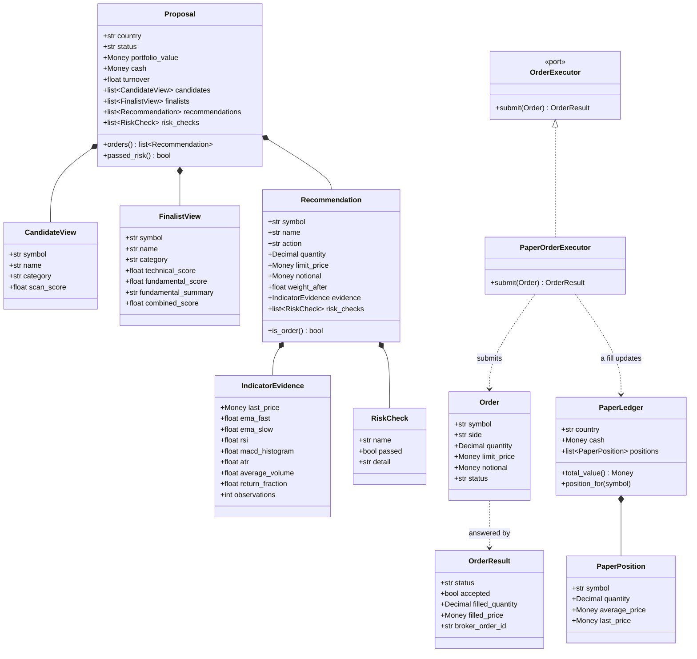
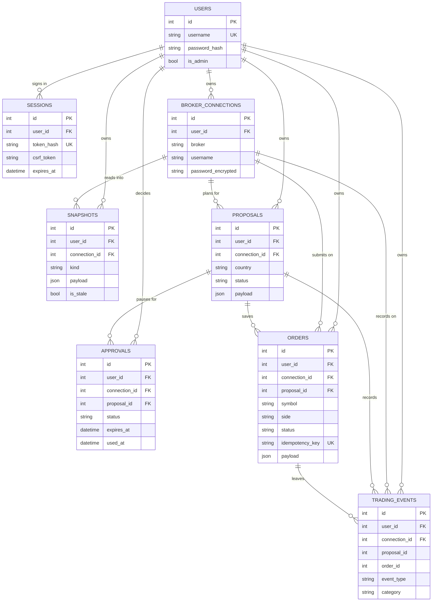

# Day 5: Human approval and paper execution

Day 5 turns a saved proposal into an approved paper trade. It builds the
LangGraph flow that plans, pauses for a human decision, re-checks the saved data,
and applies approved orders to the paper ledger. The graph never sends a live
order: the only executor wired in is the paper one.

## What Day 5 adds

- A LangGraph trading flow: `plan -> request_approval -> await_approval ->
  recheck -> submit`.
- A single-use, 24-hour approval that covers the whole plan.
- A fresh-data check that stops a stale plan before it is executed.
- A paper executor and an `OrderExecutor` port, so live trading can be added
  later without touching the flow.
- Orders saved before submission, with a stable idempotency key.
- A paper ledger that updates on a fill: cash, positions, and average price.
- A local, append-only trading event log.
- A proposal review page with approve/reject controls.
- A personal history page for orders and events.

## What you can do now

Follow this order:

1. **Log in.** Log out when finished. Each user sees only their own data.
2. **Connect IOL.** Save an encrypted connection and read the profile, account
   status, and country portfolio.
3. **Refresh the data.** Refresh the portfolio and prices. If IOL fails, the
   last good snapshot remains available.
4. **Create the paper ledger.** Copy the saved portfolio into the simulated
   ledger.
5. **Run an analysis.** The application calculates indicators, applies the fixed
   strategy, sizes orders, and checks the risk limits.
6. **Review the proposal.** Open the proposal and inspect its evidence,
   quantities, risk results, and approval status.
7. **Approve or reject the full plan.** Both actions use a CSRF-protected form.
8. **Let approval trigger a fresh check.** An approved plan compares the latest
   saved prices and cash before any order is submitted.
9. **Apply paper fills.** Confirmed orders update cash, positions, and average
   prices in the paper ledger.
10. **Review the history.** Open History to see saved orders and every local
    event from the run.

You can also restart the application while approval is pending. The saved plan
remains in PostgreSQL, and restarting does not create a duplicate order.

You cannot yet enable automatic trading, place a live IOL order, cancel an
order, or automatically reconcile an unclear result. Those remain later work.

## Requirements

- The Day 1 to Day 4 setup, with a saved connection, a portfolio refresh, and a
  paper ledger for the country.
- `langgraph`, added to `requirements.txt`.
- No new environment variables.

## 1. Install and start

The setup is the same as Day 1 to Day 4.

```bash
docker compose up --build
```

Or run it locally:

```bash
python -m pip install -r requirements-dev.txt
uvicorn app.main:app --reload
```

Then open `http://localhost:8000` and log in.

## 2. Run an analysis

Open **Analysis**, make sure a ledger exists, and click **Run analysis**.

If the plan holds no order, the run stops with `no_trade` and there is nothing to
approve. If it holds an order, the run pauses with `awaiting_approval` and an
approval panel appears on the page.

The analysis runs the funnel over the configured universe, which is declared in
`config/universe.toml` with each ticker and its paper name: the market scanner
keeps the strongest candidates on cheap price readings, the technical stage
scores them, and the fundamental/news stage picks the finalists. Only a
finalist may be bought, and the risk manager turns at most a few of them into
orders under the portfolio constraints in the same file.

Before the plan is built, the run refreshes price history for every symbol it
will judge. A failed refresh does not stop the run: the symbol is judged on the
history already saved, and the page shows one warning naming each affected
symbol and the reason. A broker failure is therefore never reported as "not
enough history".

## 3. Review and decide

Click **Open the full review page**, or open **Proposals**, to see:

- the plan summary, status, approval mode, and execution mode;
- the funnel the run produced: the configured universe, the market scanner's
  candidates, and the finalists with both scores and the outside view on each;
- every plan risk check, passed or failed;
- the approval state and, when it is pending, the approve and reject buttons;
- the orders saved for the proposal;
- a timeline of every event recorded for the run.

**Approve** re-checks the latest saved prices and cash and, if nothing moved too
far, submits the orders to the paper executor. **Reject** closes the plan with no
order.

## The flow

The graph is built in `app/workflows/trading_flow.py` with LangGraph. It is
deliberately re-entrant: PostgreSQL is the source of truth, and the graph
re-derives its position from the saved proposal and approval on every invocation,
so a restart changes nothing.

```text day5/README.md
start_run:
  plan            create and save the proposal once
  request_approval open one approval, or reuse the existing one
  await_approval  stop while pending; continue once approved
  recheck         compare the plan to the latest saved data
  submit          consume the approval and apply the orders on paper

resume_run:
  the same graph, invoked again with the saved proposal and approval
```

Every step is idempotent:

- the plan step loads the saved proposal instead of saving a second one;
- the approval step reuses any existing approval, in any state, so a rejected or
  expired decision is never reopened;
- the submit step finds orders by their idempotency key and never sends one a
  second time.

## Domain models and database

Two pictures cover what a Day 5 run passes around and where it is stored. The
services in `app/services/` are modules of functions rather than classes, so
they are not drawn; the domain models and the one port the flow touches are.

### Domain models



`Proposal` is the immutable plan the review page shows: it carries the funnel
result (candidates and finalists), every recommendation with its evidence and
risk results, and the plan-level checks. `PaperOrderExecutor` is the only
executor wired into the flow, which is what keeps live trading from leaking
into a run; a live adapter would implement the same `OrderExecutor` port.

### Database



The parts that are easy to miss:

- `snapshots.kind` decides what `payload` holds: `profile`, `account_status`,
  `portfolio:{country}`, `price_history:{SYMBOL}`, and `paper_ledger:{country}`.
  The paper ledger has no table of its own; it lives here as one JSON document.
- `orders.payload` is the full domain `Order`, including the fill, and
  `proposals.payload` is the immutable `Proposal`. The row columns are only what
  is queried on; everything else is stored once and read back as the model.
- `trading_events.proposal_id` and `order_id` are plain integers, not foreign
  keys, so an event survives the row it talks about.
- LangGraph keeps no state table. The graph re-derives its position from
  `proposals`, `approvals`, and `orders` on every invocation, which is why a
  restart while approval is pending changes nothing.

## Approval rules

| Rule | Value |
| --- | --- |
| Mode | `HUMAN_IN_THE_LOOP` only (automatic is Day 6) |
| Scope | the whole proposal |
| Expiry | 24 hours |
| Uses | one |
| Protection | CSRF token and owner check on every decision |

An approval moves through `pending`, then `approved`, `rejected`, or `expired`,
and finally `consumed` once its plan is executed. A second approval after a
decision is refused.

## The fresh-data check

Before an approved plan is submitted, the graph re-reads the latest saved cash
and price for every order and compares it with the plan:

- cash moved more than 5%, or a price moved more than 5% — the plan is blocked;
- otherwise the plan proceeds.

A blocked plan records the reason and creates no order. Refreshing the data and
approving again is the human path forward.

## Orders and idempotency

An order is saved before anything is submitted, under a key of the form
`proposal:<id>:<side>:<symbol>`. Submitting the same plan again finds the same
row instead of creating a second order.

The paper executor fills at the limit price. A fill updates the paper ledger:
buying spends cash and raises the position's quantity and average price; selling
lowers the quantity and adds cash, and closing a position removes it.

If the executor returns an unclear result, the order is marked `unknown`,
recorded, and **never sent again**. There is no automatic retry.

## The history page

**History** shows, for one connection, the saved orders and the local event log:
run started, plan created, approval requested/approved/rejected/expired, order
prepared/filled/rejected/unknown, and ledger updated. It reads only the local
database, so it makes no IOL calls. Everything is scoped to the signed-in user.

## Tests

```bash
python -m pytest tests/test_ledger_fills.py tests/test_approvals.py \
  tests/test_orders.py tests/test_execution.py tests/test_trading_flow.py \
  tests/test_proposal_pages.py -q
```

Or run everything:

```bash
python -m pytest -q
```

The flow tests cover the full path, a repeated resume after completion, a restart
while a plan is pending, a rejection, and a price move that blocks an approved
plan. All tests run offline against a scripted fake broker.

## Troubleshooting

- **"Could not refresh the price history for GGAL (...)"** — the analysis ran,
  but IOL did not answer for that symbol, so it was judged on saved data. The
  reason in brackets is the broker's own message (a 404, a 500, a timeout, or
  the call budget being spent). Refresh and run again once the broker answers.
  Saved snapshots are kept; a failed refresh marks them stale, never deletes
  them.
- **"No order has been saved"** on the review page — that is correct before an
  approval. The orders appear once the plan is executed.
- **The approve button is gone** — the approval was already decided or has
  expired. Run a fresh analysis.
- **The plan is blocked after approval** — the price or cash moved too far since
  the review. Refresh the data and run again.
- **An order is `unknown`** — the executor did not confirm it. It is left for
  review and will not be resent automatically.

## Money and security notes

- Sizing, risk, and ledger updates use the exact `Money` type, not floats.
- Only the paper executor is wired in. There is no live order path on Day 5.
- An approval is single-use, expiring, CSRF-protected, and owner-scoped.
- Passwords and tokens never reach the workflow, the events, or the history
  page. Logs contain no credentials.
- An order with an unclear result is never resent automatically.
